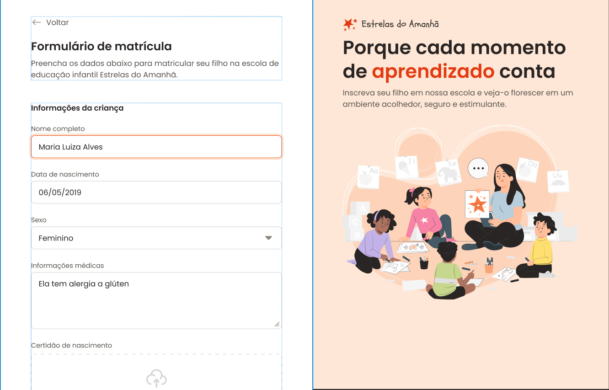

# Formulário de Matrícula

Projeto de estudo front-end que reproduz um formulário estático de matrícula para uma escola de educação infantil, com dados da criança, endereço residencial, informações do responsável, opções de matrícula e termos de aceite.



## ✨ Funcionalidades

- Seção "Informações da criança" com nome, data de nascimento, sexo, informações médicas e upload da certidão de nascimento (dropzone de arquivo)
- Seção "Endereço residencial" com CEP, rua, número, cidade e estado
- Seção "Informações do responsável" com nome, telefone e e-mail (com validação e mensagem de erro)
- Seção "Opções de matrícula" com seleção de turno de estudo e modalidade esportiva via inputs radio customizados
- Checkbox customizado de aceite dos Termos e Condições / Política de Privacidade
- Ações de formulário: salvar respostas e fazer matrícula
- Sidebar (aside) com logo, chamada institucional e ilustração
- Layout construído com CSS Grid

## 🚀 Tecnologias

- HTML5
- CSS3 (Grid Layout)
- Google Fonts (Poppins)

## 📁 Estrutura do projeto

```
formulario/
├── index.html
├── assets/
│   ├── icons/
│   ├── logo.svg
│   ├── Illustration.svg
│   └── ...ícones de esportes e clima
└── styles/
    ├── index.css        # importa os demais arquivos de estilo
    ├── global.css        # reset, variáveis e estilos globais
    ├── layout.css         # layout geral da página (main/aside)
    ├── form.css           # estrutura do formulário e fieldsets
    └── fields/
        ├── index.css      # importa os estilos dos campos
        ├── inputs.css     # inputs de texto, select e textarea
        ├── radio.css      # inputs radio customizados
        ├── checkbox.css   # checkbox customizado
        ├── droparea.css   # área de upload de arquivo
        └── buttons.css    # botões de ação
```

## 💻 Como rodar

Este é um projeto estático (sem dependências ou build), então basta:

Clonar o repositório
```
git clone https://github.com/RafaelJuniorM/formsMatricula.git
```

Abrir o arquivo `index.html` no navegador (ou usar a extensão Live Server)
